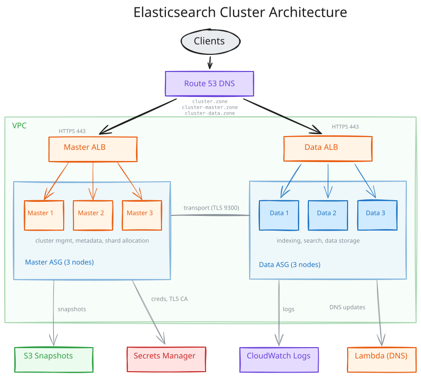
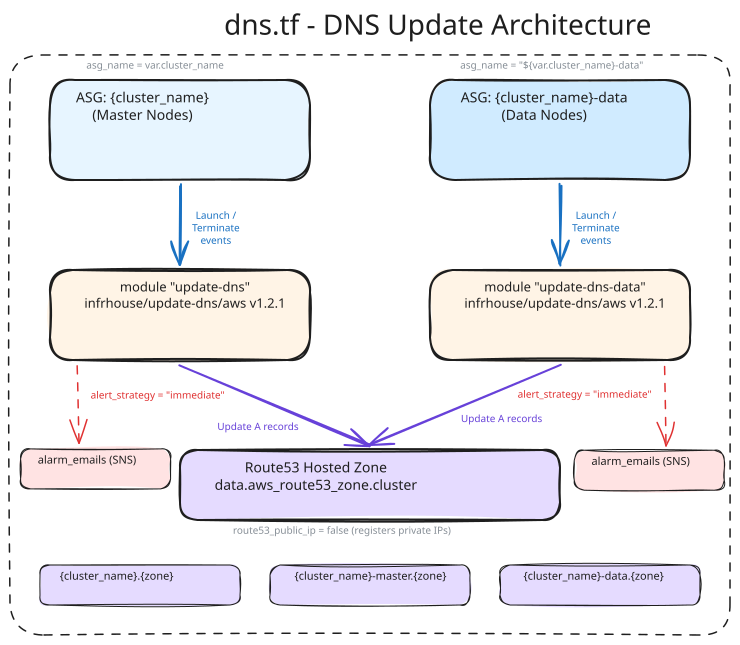

# Architecture

The module deploys a self-managed Elasticsearch cluster as two independent node
pools, each with its own Auto Scaling Group, Application Load Balancer, and DNS
records. Nodes configure themselves with Puppet on first boot and join the cluster
through ASG lifecycle hooks.

## Two-tier node layout

| | Master nodes | Data nodes |
|---|---|---|
| Terraform module | `module.elastic_cluster` | `module.elastic_cluster_data` |
| Puppet role | `elastic_master` | `elastic_data` |
| Default count | 3 (`cluster_master_count`, must be odd) | 3 (`cluster_data_count`) |
| Responsibility | Cluster state, metadata, shard allocation | Indexing, search, storage |
| ASG name | `${cluster_name}` | `${cluster_name}-data` |
| Instance profile | `${cluster_name}-master-${random_suffix}` | `${cluster_name}-data-${random_suffix}` |
| DNS records | `${cluster_name}`, `${cluster_name}-master` | `${cluster_name}-data` |
| Deployed when | Always | Only when `bootstrap_mode = false` |

Master count must be odd so the cluster can form a quorum; the variable validation
rejects even numbers. Size the pools independently with `instance_type_master` and
`instance_type_data` - masters hold cluster state and need much less memory than
data nodes.

Both pools are built from
[infrahouse/website-pod/aws](https://registry.terraform.io/modules/infrahouse/website-pod/aws/latest),
which provides the ASG, the ALB with its HTTPS listener and ACM certificate, the
target group on port 9200, and the CloudWatch alarms.

## Bootstrap mode

A brand new cluster cannot be created in one apply: the first Elasticsearch node has
to form the cluster before any other node can join it. `bootstrap_mode` controls
which phase you are in.

=== "Phase 1: `bootstrap_mode = true`"

    - Master ASG min and max size are pinned to 1.
    - The single master boots with the custom fact `elasticsearch.bootstrap_cluster = true`,
      which makes Puppet configure `cluster.initial_master_nodes`.
    - No data nodes are created (`module.elastic_cluster_data` has `count = 0`).
    - Credentials, the CA certificate, the snapshot bucket, and the log group are created.

=== "Phase 2: `bootstrap_mode = false`"

    - The master ASG scales to `cluster_master_count`.
    - The data ASG is created with `cluster_data_count` nodes.
    - Every node boots with `bootstrap_cluster = false` and joins the existing cluster.
    - Data node instance profiles are added as readers of the credential secrets.

Terraform waits for the ASG instance refreshes during phase 2, so the second apply
takes considerably longer than the first.

## Node lifecycle

Both ASGs carry a launching and a terminating lifecycle hook, each with a 3600 second
heartbeat timeout.

| Hook | Transition | Default result | Purpose |
|------|-----------|----------------|---------|
| `launching-${suffix}` | `EC2_INSTANCE_LAUNCHING` | `ABANDON` | Hold the node in `Pending:Wait` until it joins |
| `terminating` | `EC2_INSTANCE_TERMINATING` | `CONTINUE` | Let the node drain shards before it goes away |

On launch, cloud-init runs Puppet and then
`ih-elastic cluster commission-node --complete-lifecycle-action <hook>`. The node
only leaves `Pending:Wait` once it is a member of the cluster, so a broken node fails
the refresh instead of silently joining a degraded cluster. `ABANDON` as the default
result means a timeout terminates the instance rather than putting a half-configured
node into service.

On termination the node decommissions itself: shards are moved off before the
lifecycle action completes. `CONTINUE` as the default result means a stuck
decommission does not block the ASG forever.

The launching hook name carries a random suffix. Renaming the hook forces a new
instance refresh, which is how the module rolls nodes when the userdata changes.

## DNS

Each ASG has a dedicated
[update-dns](https://registry.terraform.io/modules/infrahouse/update-dns/aws/latest)
Lambda that reacts to launch and terminate events and rewrites the Route53 A records
with the private IPs of the healthy instances. Both Lambdas use
`alert_strategy = "immediate"` - a DNS failure is a cluster-wide outage, so it pages
without waiting for a threshold.

The hosted zone is addressed through the `aws.dns` provider alias, so the zone can
live in a different AWS account than the cluster. In a single-account setup both
providers point at the same account.

## Network and ports

| Port | Exposure | Purpose |
|------|----------|---------|
| 443 | ALB, from your networks | HTTPS clients, terminated at the load balancer |
| 9200 | Instances, from the ALB | Elasticsearch HTTP API |
| 9300 | Instances, from the cluster security group only | Elasticsearch transport, node-to-node |
| 9100 | Instances, from `monitoring_cidr_block` | Prometheus `node_exporter` |
| 9114 | Instances, from `monitoring_cidr_block` | Prometheus `elasticsearch_exporter` |
| 22 | Instances, from `ssh_cidr_block` | SSH |

The transport port is opened by a self-referencing rule on the module's own security
group (`aws_security_group.backend_extra`), so only cluster members reach 9300 - no
CIDR range is involved. The exporter rules are created only when
`monitoring_cidr_block` is set, and the variable validation rejects `0.0.0.0/0`.

## Encryption and secrets

- **In transit, node to node**: the module generates an RSA 4096 CA
  (`tls_self_signed_cert.ca_cert`) and stores the key and certificate in Secrets
  Manager. Puppet issues node certificates from it for the transport layer on 9300.
- **In transit, client to cluster**: the ALB terminates HTTPS on 443 with an ACM
  certificate for the cluster domain, using the `ELBSecurityPolicy-TLS13-1-2-Ext1-2021-06`
  policy. Between the ALB and the instances the target group speaks HTTP to port 9200
  inside the VPC. Instances also receive Let's Encrypt configuration through the
  `letsencrypt` custom fact for certificates issued on the node itself.
- **At rest**: the snapshot bucket comes from
  [infrahouse/s3-bucket/aws](https://registry.terraform.io/modules/infrahouse/s3-bucket/aws/latest)
  with encryption and cross-region replication into `replication_region`.
  CloudWatch logs are encrypted with a customer-managed KMS key that rotates every
  `cloudwatch_kms_rotation_period_days` days.

All four secrets - the `elastic` password, the `kibana_system` password, the CA key,
and the CA certificate - are created with
[infrahouse/secret/aws](https://registry.terraform.io/modules/infrahouse/secret/aws/latest),
which records who may read them. Instances receive secret *names* through userdata
and fetch the values at boot with their instance profile; no secret value is ever
written into userdata. Add human or automation roles with `secret_elastic_readers`.

## IAM

Both node pools share one policy document (`data.aws_iam_policy_document.elastic_permissions`
in `iam.tf`), attached to each pool's own instance role:

- `ec2:DescribeInstances` and `autoscaling:DescribeAutoScalingInstances` for the
  [EC2 discovery plugin](https://www.elastic.co/guide/en/elasticsearch/plugins/current/discovery-ec2-usage.html).
- `autoscaling:CompleteLifecycleAction`, `RecordLifecycleActionHeartbeat`,
  `SetInstanceHealth`, and `CancelInstanceRefresh`, scoped to this cluster's two ASGs.
- `route53:ChangeResourceRecordSets` on the cluster hosted zone only, for Let's Encrypt
  DNS-01 challenges.
- `secretsmanager:GetSecretValue` on exactly the four secrets above.
- S3 read and write on the snapshot bucket only.
- CloudWatch Logs write access and KMS decrypt, added only when
  `enable_cloudwatch_logging` is true.

Extra permissions can be appended as a policy document JSON through
`extra_instance_profile_permissions`.

## Observability

- **Logs**: `/elasticsearch/${environment}/${cluster_name}`, retained for
  `cloudwatch_log_retention_days` (365 minimum, enforced by validation) and encrypted
  with the module's KMS key. The log group name is passed to the instances as the
  `elasticsearch.cloudwatch_log_group` custom fact.
- **Alarms**: each `website-pod` instance creates ALB alarms - unhealthy hosts, target
  response time, success rate, and CPU utilization. The DNS Lambdas add error alarms.
  Notifications go to `alarm_emails` and to any topics in `alarm_topic_arns`.
- **Metrics**: `node_exporter` and `elasticsearch_exporter` run on every instance for
  Prometheus to scrape.

## Module composition

| Module | Version | What it provides |
|--------|---------|------------------|
| `infrahouse/website-pod/aws` | 6.4.0 | ASG, ALB, target group, ACM certificate, CloudWatch alarms |
| `infrahouse/cloud-init/aws` | 2.4.0 | Userdata that installs Puppet and applies the node role |
| `infrahouse/update-dns/aws` | 1.5.1 | Lambda that maintains the A records on ASG events |
| `infrahouse/secret/aws` | 1.3.0 | Secrets Manager secrets with an explicit reader list |
| `infrahouse/s3-bucket/aws` | 0.9.0 | Snapshot bucket with encryption and cross-region replication |

## File layout

| File | Contents |
|------|----------|
| `main.tf` | Both node pools, both userdata modules, lifecycle hooks |
| `locals.tf` | `service_name`, `module_version`, log group name, common tags |
| `iam.tf` | The instance profile policy document |
| `dns.tf` | The two `update-dns` Lambda modules |
| `cloudwatch.tf` | Log group, KMS key, key policy, logging permissions |
| `s3.tf` | Snapshot bucket |
| `secrets.tf` | `elastic` and `kibana_system` passwords |
| `tls.tf` | CA key and certificate, and their secrets |
| `extra_security_group.tf` | Transport and Prometheus exporter rules |
| `datasources.tf` | AMI lookup, hosted zone, caller identity |

## What's next

- [Getting Started](getting-started.md) - deploy the cluster
- [Configuration](configuration.md) - every variable explained
- [Operations](operations.md) - run the cluster with `ih-elastic`
- [Examples](examples.md) - complete configurations to copy
