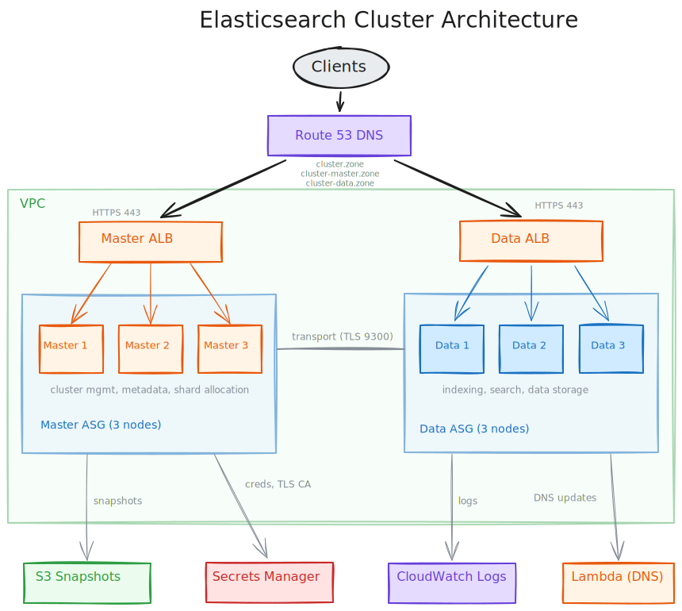
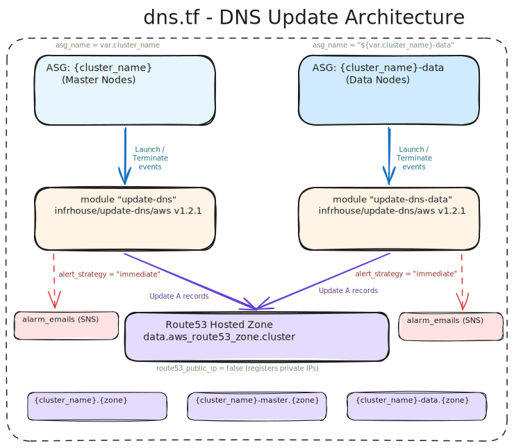

# terraform-aws-elasticsearch

Terraform module that deploys a self-managed, multi-node Elasticsearch cluster on AWS EC2
with separate master and data node pools, ALB endpoints, and automated node lifecycle management.

## Why this module?

AWS OpenSearch Service doesn't support all Elasticsearch features and plugins.
This module deploys vanilla Elasticsearch on EC2, giving you full control over
configuration, plugins, and version upgrades while automating the infrastructure:
ASGs, ALBs, DNS, TLS certificates, secrets, snapshots, and CloudWatch logging.

## Architecture



### Master nodes

- Handle cluster management, metadata, shard allocation
- Default: 3 nodes (must be odd for quorum)
- Endpoints: `https://{cluster_name}.{zone}` and `https://{cluster_name}-master.{zone}`

### Data nodes

- Handle indexing and search operations
- Default: 3 nodes
- Endpoint: `https://{cluster_name}-data.{zone}`
- Only deployed when `bootstrap_mode = false`

### What the module creates

| Resource | Purpose |
|----------|---------|
| 2 Auto Scaling Groups | Master and data node pools |
| 2 Application Load Balancers | HTTPS endpoints for master and data nodes |
| Route53 DNS records | Cluster, master, and data endpoints |
| CloudWatch Log Group + KMS key | Centralized logging with encryption |
| S3 bucket | Elasticsearch snapshot storage |
| Secrets Manager secrets | elastic password, kibana_system password, TLS CA cert/key |
| TLS CA certificate | Inter-node transport encryption |
| IAM roles and policies | Least-privilege instance profiles |
| ASG lifecycle hooks | Graceful node commissioning and decommissioning |
| Lambda functions | DNS record updates on instance launch/terminate |

### DNS update flow



Each ASG (master and data) has a dedicated Lambda function (`update-dns` module)
that reacts to instance launch/terminate events and updates Route53 A records
with the instance private IPs. Both use `alert_strategy = "immediate"` for
SNS alarm notifications.

## Quick start

See [Getting Started](getting-started.md) for a complete walkthrough.

```hcl
module "elasticsearch" {
  source  = "registry.infrahouse.com/infrahouse/elasticsearch/aws"
  version = "4.1.0"

  providers = {
    aws     = aws
    aws.dns = aws
  }

  cluster_name  = "my-cluster"
  environment   = "production"
  key_pair_name = "my-keypair"
  subnet_ids    = module.service-network.subnet_private_ids
  zone_id       = data.aws_route53_zone.main.zone_id

  alarm_emails = ["ops@example.com"]

  # Use t3.large minimum -- t3.medium causes OOM/swap issues
  instance_type = "t3.large"

  # Start in bootstrap mode, then set to false after first apply
  bootstrap_mode = true
}
```

## Instance sizing

!!! warning "Do not use t3.medium"
    The default `instance_type` is `t3.medium` (4GB RAM) for backwards compatibility,
    but it is **too small** for production use. Elasticsearch needs memory for both the
    JVM heap (~50% of RAM) and Lucene filesystem cache (the other ~50%).

    With `memory_lock = true` (default), the JVM heap is locked in RAM and cannot be
    swapped. On a 4GB instance there is not enough memory for the OS, Lucene cache,
    and the ML controller process -- the OOM killer will terminate Elasticsearch.

| Instance type | RAM | JVM heap | Filesystem cache | Recommendation |
|---------------|-----|----------|-----------------|----------------|
| `t3.medium` | 4 GB | ~1.9 GB | ~0.8 GB | **Too small.** OOM risk with memory_lock |
| `t3.large` | 8 GB | ~4 GB | ~3.3 GB | Minimum for light workloads |
| `r6i.large` | 16 GB | ~8 GB | ~7 GB | Good for production |
| `r6i.xlarge` | 32 GB | ~16 GB | ~15 GB | Heavy indexing/search |

Use `instance_type_master` and `instance_type_data` to size node pools independently.
Master nodes have lighter memory requirements than data nodes.

## Kibana

Add a web UI with the companion
[terraform-aws-kibana](https://github.com/infrahouse/terraform-aws-kibana)
module. It deploys Kibana on ECS, pointing at your cluster.
See [Operations > Kibana](operations.md#kibana) for a usage example.

## Documentation

- [Getting Started](getting-started.md) -- Prerequisites, bootstrap, and first deployment
- [Configuration](configuration.md) -- Variables reference with examples
- [Operations](operations.md) -- Cluster management with `ih-elastic` and Kibana
- [Troubleshooting](troubleshooting.md) -- Common issues and how to fix them
